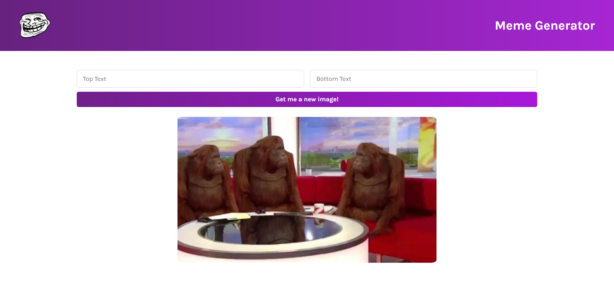

# Meme Generator Website

## Table of contents

- [Screenshot](#screenshot)
- [Links](#links)
- [Built with](#built-with)
- [Useful resources](#useful-resources)
- [Author](#author)

### Screenshot

Mobile view:

### Links
- Live Site URL: [Live site URL](https://meme-generator07.netlify.app/)

### Built with

- Semantic HTML5 markup
- CSS
- Flexbox
- Desktop-first workflow
- [React](https://react.dev/)
- [ViteJs](https://vitejs.dev/)

### Useful resources

- [Scrimba Learn React](https://scrimba.com/learn/learnreact) - I recently learned basics of react from this Scrimba course and it was amazing learning experience. The interactive tutorials helped me learn very fast and easily.
- [API](https://api.imgflip.com/get_memes) - Used imgflip's API to get random meme images.

## Author
- Twitter - [@MananBhatia02](https://twitter.com/MananBhatia02)

